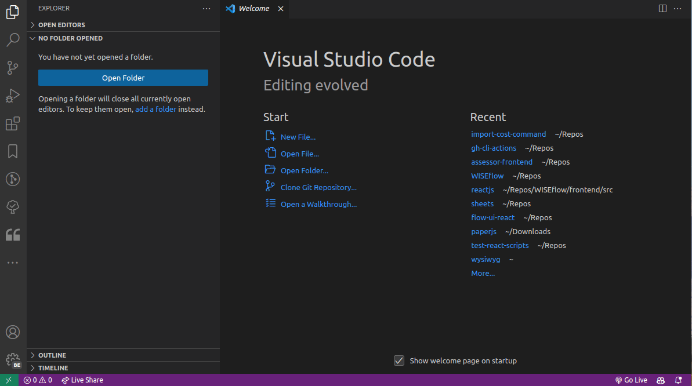
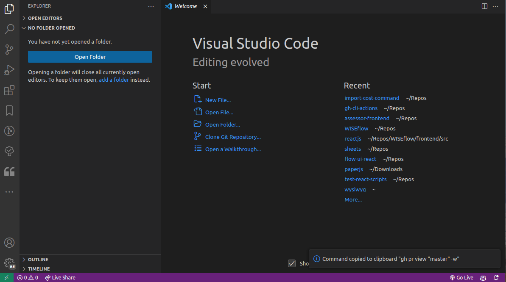

# Github CLI Actions for VSCode

Run Github CLI targets from the command palette.

## Features

Run `gh` commands directly from the command palette. You can dynamically choose whether or not to run the command behind the scenes, in the terminal or just copy the output.

You can save and manage shortcuts to often used commands.

Commands, inputs, and flags are scraped from the [Github CLI manual](https://cli.github.com/manual/gh_api) and most are supported

## Requirements

It is required that you have the Github CLI installed. Install from here https://cli.github.com/.

Checkout their getting started guide for authentication and setup.

## Extension Settings

Include if your extension adds any VS Code settings through the `contributes.configuration` extension point.

For example:

This extension contributes the following settings:

* `gh-cli-actions.ghShortcuts`: Listing of created shortcuts. Create new shortcuts manually from the settings menu or via "gh: Create a gh command shortcut".
* `gh-cli-actions.lastCommand`: The last command to be run.
* `gh-cli-actions.hideOptions`: List of commands to hide from the command input. This can be used to clear some clutter in the menu.
* `gh-cli-actions.favorite`: List of commands to be sorted in the top of the command selection quick menu.

## Potential future additions

* Allow going back in a command (i.e. moving one step back in the command)
* Allow adding inputs and/or flags to shortcuts. Allowing you to create shortcuts that you can still add input or flags to.
* Grab specific options from manual scraping to allow inputs to have options.